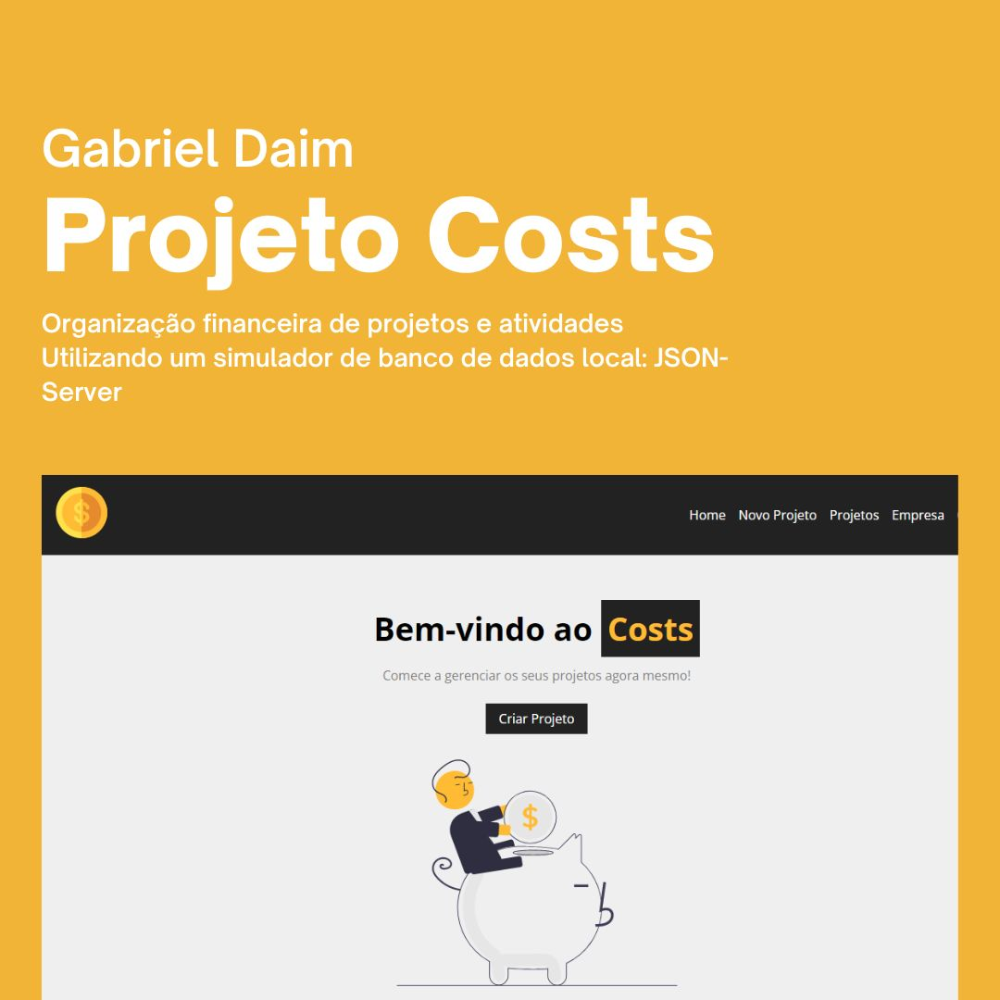

<h1 align="center"> Site CostsApp, para planejamento de finanças </h1>

  <a href="#-tecnologias">Tecnologias</a>&nbsp;&nbsp;&nbsp;|&nbsp;&nbsp;&nbsp;
  <a href="#-Instruções">Instruções</a>&nbsp;&nbsp;&nbsp;|&nbsp;&nbsp;&nbsp;
  <a href="#memo-licença">Licença</a>&nbsp;&nbsp;&nbsp;|&nbsp;&nbsp;&nbsp;
  <a href="#autor">Autor</a>

  

 

  

## 🚀 Tecnologias

Esse projeto foi desenvolvido com as seguintes tecnologias:

- HTML e CSS
- Git e Github
- JavaScript

**O que usamos nesse projeto:**

- Organização de Github, readme, imagens, hacks para tabela de readme
- Input, Select e Button customizados
- Uso de ícones e fontes customizdas
- HTML: `form`,`header`,`main`,`section`,`form`,`select`,`img`,
- CSS: `all`, `overflow`, `::before`, `::after`, `rem`, `position`, `fit-content`, `flex e grid`, `@media`, `responsividade`
- JavaScript: `DOM`,`React`
- JsonServer: `Simulando um banco de dados`

## 🔖 Instruções

**Para rodar o projeto localmente:**

- npm i  
- npm run backend 
- npm run dev 

## :memo: Licença

Esse projeto está sob a licença MIT.

## Autor

Feito com 💜 por Gabriel Daim
